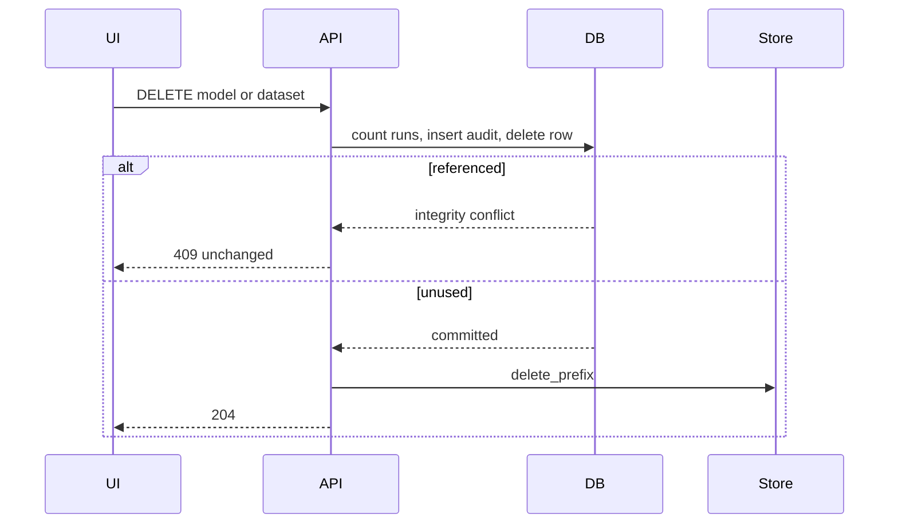

# Add remove operations for models and datasets

## Overview

Expose user-facing **remove** so a Publisher can delete an unused HDFS model
version (eligible or published) and an Operator can delete an unused uploaded
dataset. This completes CRUD for those two persisted item types without
cascading analysis history.

## Current State Analysis

- Create/Read exist for models and datasets; models also have an explicit
  publish **update**. There is **no public DELETE**. README still said E2E has
  no model-delete API (`README.md`).
- The PRD already requires that uploaded logs and models remain until an
  authorized user deletes them (`context/foundation/prd.md` Constraints).
- `ApiDatabase.delete_model_version` already fail-closes when `analysis_runs`
  reference the version. CLI `src/api/retire_v1.py` deletes object prefixes
  then the row; it is **not** a public API.
- `analysis_runs.model_version_id` and `analysis_runs.dataset_id` are FKs
  **without** `ON DELETE CASCADE` (`src/api/migrations.py`). Archived retire-v1
  plan forbids adding CASCADE.
- Registration writes objects then inserts the row; leftover prefixes are
  deleted on insert failure. Membership revoke is the HTTP 204 + transactional
  audit pattern to copy (`src/api/routers/projects.py` `revoke_project_membership`).
- UI: `ModelsView` has Register/Publish; `DatasetPanel` lists datasets with no
  remove. `frontend/src/api.ts` already treats HTTP 204 as empty success
  (membership revoke).
- Test plan §6.4 requires 401/403/404/empty-list oracles on any new mutate
  route (`context/foundation/test-plan.md`).

## Desired End State

- `DELETE /projects/{project_id}/models/{model_version_id}` → **204** for a
  same-project Publisher when no analysis run references the version. Eligible
  and published both allowed.
- `DELETE /projects/{project_id}/datasets/{dataset_id}` → **204** for a
  same-project Operator (Publisher counts as Operator) when no analysis run
  references the dataset.
- Success writes `model.deleted` / `dataset.deleted` in the **same DB
  transaction** as the row delete, then removes object prefixes.
- Unshared preprocessing bundle row + prefix are removed with the last model
  that referenced them; shared bundles stay.
- Referenced resources return **409**, leave rows and objects unchanged.
- Cross-project / unknown ids return **404**. Wrong role on model delete
  returns **403** and inserts nothing. Unauthenticated **401**.
- React: visible Remove actions, confirm dialog, success Banner; 403/409 show
  `role="alert"` and no success copy. Buttons stay visible (hiding is not the
  security control).
- After a successful model delete, if that id was selected for analysis,
  selection is cleared.

## What We're NOT Doing

- Deleting analysis runs, results, or audit history
- `ON DELETE CASCADE` or nulling FKs
- Playwright specs (HTTP + Vitest only)
- Soft-delete columns / new migrations unless SQLite/Postgres forces one
  (none expected)
- Public unpublish, dataset PATCH, or project delete
- Changing `retire_v1` CLI behavior except that it can keep using the storage
  helper

## Implementation Approach

Fail-closed integrity check **inside** the deleting transaction (same as
`delete_model_version` today). Commit row + audit first, **then**
`object_store.delete_prefix`. That prefers leftover objects over dangling
metadata. If prefix delete fails after commit, log and still treat the API
delete as succeeded (retry would 404). Do not delete objects before the
transaction — a later FK conflict would strand an empty package while the row
still listed it.

## Critical Implementation Details

- **Object vs DB order:** commit metadata delete first, then prefixes. Inverse
  of admission (objects then row) and of `retire_v1` apply. Required because
  audit must be transactional and S3/filesystem deletes cannot roll back.
- **Bundle sharing:** count other `model_versions` with the same
  `preprocessing_bundle_id` **before** deleting the model row. Delete the
  bundle row only when that count is zero after this model is removed.
  Registration usually inserts a new bundle per version; still handle reuse.
- **Role visibility:** do not hide Remove on Operator for models. Mirror
  Register/Publish: send the request, show API 403.
- **Workspace-kind leftovers:** if `storage_kind != "object"`, still delete
  the DB row when unused; skip prefix delete (same skip idea as retire_v1, but
  the public path is object-kind).
- **Audit actor:** public DELETE inserts `model.deleted` / `dataset.deleted`
  only when `actor_user_id` is set. CLI `retire_v1` keeps calling the helper
  without an actor so its audit-id oracle stays unchanged.

## Phase 1: Persistence and HTTP DELETE

### Overview

Add storage helpers and two FastAPI DELETE routes with isolation/role/lifecycle
tests.

### Changes Required

#### 1. Storage

**File:** `src/api/storage.py`

**Intent:** Delete an unused model version (and an unused unshared bundle row)
plus audit in one transaction; same for datasets.

**Contract:** Extend or replace `delete_model_version` so it accepts
`actor_user_id`, inserts `model.deleted`, fail-closes on run count > 0, and
returns enough prefix data for the router (`package_reference`, optional bundle
prefix to delete). Add `count_analysis_runs_for_dataset` and `delete_dataset`
with `dataset.deleted`. Do not add CASCADE. Keep raising
`DatabaseIntegrityError` when referenced so routers map **409**.

#### 2. Model route

**File:** `src/api/routers/models.py`

**Intent:** Publisher-authorized hard delete of a project-owned model version.

**Contract:** `DELETE /projects/{project_id}/models/{model_version_id}`, `204`,
`require_project_role(..., {PUBLISHER})`. Missing/foreign id →
`not_found("Model version")`. After successful DB delete, `delete_prefix` on
package_reference and, when indicated, bundle prefix. Map integrity → 409 with
a stable Operator-safe detail (no exception text, no object keys).

#### 3. Dataset route

**File:** `src/api/routers/datasets.py`

**Intent:** Operator-authorized hard delete of a project-owned uploaded
dataset.

**Contract:** `DELETE /projects/{project_id}/datasets/{dataset_id}`, `204`,
Operator role (Publisher satisfies Operator). Use
`dataset_object_prefix(project_id, dataset_id)` after commit. Same 404/409
mapping.

#### 4. OpenAPI oracles

**File:** `tests/test_api.py`

**Intent:** Lock the new verbs into the existing OpenAPI tag map and isolation
matrix.

**Contract:** Add `delete` to `_OPENAPI_TAG_MAP` for both item paths. Cover
unauthenticated 401, foreign/IDOR 404, Operator model DELETE 403 with objects
unchanged, Publisher unused eligible and published 204, shared-bundle keep,
queued or completed run 409, Operator unused dataset 204, cross-project
dataset 404. Keep Torch out of these tests. Do not mock the object store;
assert leftover keys via `_object_files`.

### Success Criteria

#### Automated Verification

- `python -m pytest tests/test_api.py -m "not ml"` passes, including new
  DELETE cases
- `ruff check src/api/storage.py src/api/routers/models.py
  src/api/routers/datasets.py tests/test_api.py`
- `mypy`

#### Manual Verification

- OpenAPI `/docs` shows both DELETE operations with bearer security

**Implementation Note**: After completing this phase and all automated
verification passes, pause here for manual confirmation from the human that
the manual testing was successful before proceeding to the next phase.

---

## Phase 2: React confirm dialogs and deny-copy tests

### Overview

Wire client DELETE, confirm-then-remove UI, and Vitest oracles so 403/409
never look like success.

### Changes Required

#### 1. API client

**File:** `frontend/src/api.ts`

**Intent:** Call the new routes with the existing 204 handling.

**Contract:** `deleteModel(projectId, modelId)` and
`deleteDataset(projectId, datasetId)` using `method: "DELETE"`.

#### 2. Models UI

**Files:** `frontend/src/features/models/ModelsView.tsx`,
`frontend/src/features/models/status.ts`, `frontend/src/App.tsx`,
`frontend/src/components/Dialog.tsx`

**Intent:** Every model card gets a visible Remove action; confirm in a
dialog; success Banner; clear selection if the deleted id was selected.

**Contract:** Reuse `Dialog`. Confirm copy must name identifier + version. Do
not hide Remove for Operators. 403/409 from `ApiError` go to page
`role="alert"` via existing Banner, no success `role="status"`.

#### 3. Dataset UI

**Files:** `frontend/src/features/runs/DatasetPanel.tsx`,
`frontend/src/features/runs/RunsView.tsx`, `frontend/src/App.tsx`

**Intent:** Each dataset card can be removed after confirmation.

**Contract:** Confirm names the short dataset id. 409 when runs exist uses
API detail. Refresh the in-memory `datasets` list after 204.

#### 4. Vitest

**File:** `frontend/src/App.role-deny.test.tsx`

**Intent:** Prove deny copy without mounting the whole shell.

**Contract:** Stub client delete to `ApiError` 403
`"Insufficient project role."` and 409; assert alert text, no success status,
stub was called, Remove still visible.

### Success Criteria

#### Automated Verification

- `npm --prefix frontend test`
- `npm --prefix frontend run typecheck`
- `npm --prefix frontend run lint`

#### Manual Verification

- Publisher: confirm delete unused eligible model → disappears; unused
  dataset → disappears
- Operator: model Remove stays visible, 403 Banner, model remains
- Referenced model/dataset: confirm → 409 Banner, resource remains
- After deleting the selected model, analysis Start is disabled until another
  published model is selected

**Implementation Note**: After completing this phase and all automated
verification passes, pause here for manual confirmation from the human that
the manual testing was successful before proceeding to the next phase.

---

## Phase 3: Documentation

### Overview

Align README and the E2E cleanup note with the new public DELETE. PRD already
allows authorized delete; no new dataset type.

### Changes Required

#### 1. README

**File:** `README.md`

**Intent:** Document Publisher/Operator DELETE, 409-when-referenced, and that
E2E still wipes `.e2e/` rather than relying on delete for isolation.

**Contract:** Replace “there is no public model-delete API”. Mention no public
PATCH for datasets remains true. Do not claim cascade delete of runs.

### Success Criteria

#### Automated Verification

- Docs-only: no new tests required beyond Phase 1–2 still passing

#### Manual Verification

- README matches OpenAPI and the 409 fail-closed rule

**Implementation Note**: After completing this phase and all automated
verification passes, pause here for manual confirmation from the human that
the manual testing was successful before proceeding to the next phase.

---

## Testing Strategy

- HTTP integration in `tests/test_api.py` is the security oracle
  (401/403/404/409 + leftover files).
- Vitest covers UI success/deny copy only.
- Reuse `_register`, `_v2_zips`, `_upload_log`, `_queued_v2_run` helpers. For
  shared-bundle, insert a second model with the first model's
  `preprocessing_bundle_id` via storage if the HTTP register path always
  creates a new bundle.
- No Playwright; no `@ml` job changes.

## Migration Notes

No schema migration. Existing FKs already block deleting referenced rows if
the count check were skipped; keep the explicit 409 mapping anyway so
SQLite/Postgres errors do not leak.

## Open Risks & Assumptions

- Best-effort object cleanup after a committed row delete can leave orphans;
  that is preferred to deleting bytes before the row is gone.
- Administrators pass `require_project_role` (current helper). They can
  delete, consistent with other member routes.
- Bundle sharing via HTTP register is uncommon; the unshared check still
  runs.

## References

- PRD retention: `context/foundation/prd.md` “until an authorized user
  deletes them”
- Test-plan new-mutate matrix: `context/foundation/test-plan.md` §6.4
- Existing fail-closed delete: `src/api/storage.py` `delete_model_version`
- Membership 204 pattern: `src/api/routers/projects.py`
  `revoke_project_membership`
- Lesson: roll back object storage on failed **admission** (create path);
  delete path uses the inverse order by design

## Progress

> Convention: `- [ ]` pending, `- [x]` done. Append ` — <commit sha>` when a
> step lands. Do not rename step titles.

### Phase 1: Persistence and HTTP DELETE

#### Automated

- [x] 1.1 Storage helpers delete unused models/datasets with transactional audit
- [x] 1.2 DELETE routes return 204/403/404/409 as specified
- [x] 1.3 `python -m pytest tests/test_api.py -m "not ml"` including DELETE oracles
- [x] 1.4 `ruff` and `mypy` pass on touched Python

#### Manual

- [ ] 1.5 OpenAPI `/docs` shows both DELETE operations with bearer security

### Phase 2: React confirm dialogs and deny-copy tests

#### Automated

- [x] 2.1 `deleteModel` / `deleteDataset` client methods
- [x] 2.2 Confirm dialogs on models and datasets; clear selected model
- [x] 2.3 Vitest 403/409 deny-copy; Remove stays visible
- [x] 2.4 `npm --prefix frontend test`, `typecheck`, and `lint` pass

#### Manual

- [ ] 2.5 Publisher removes unused eligible model and unused dataset
- [ ] 2.6 Operator model Remove stays visible, 403 Banner, model remains
- [ ] 2.7 Referenced model/dataset confirm shows 409 Banner and resource remains
- [ ] 2.8 After deleting the selected model, analysis Start stays disabled until another published model is selected

### Phase 3: Documentation

#### Automated

- [x] 3.1 README documents Publisher/Operator DELETE, 409-when-referenced, and E2E `.e2e/` wipe

#### Manual

- [ ] 3.2 README matches OpenAPI and the 409 fail-closed rule
